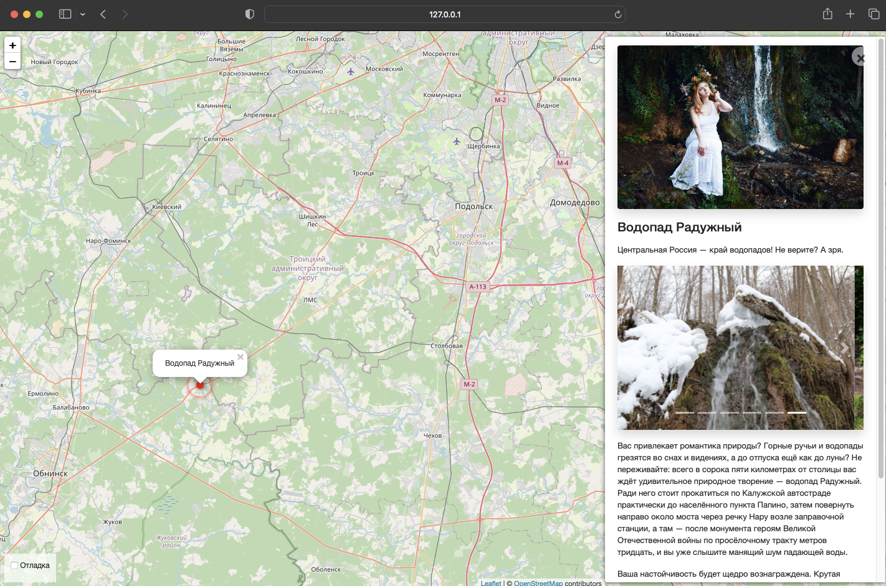

# Карта интересных мест

Блог на Django, серверная часть.
Посмотреть работающий демо_сайт можно по [ссылке](https://lexlobachev.pythonanywhere.com/).

## Переменные окружения

Часть настроек проекта берётся из переменных окружения. Чтобы их определить, создайте файл `.env` рядом с `manage.py` и запишите туда данные в таком формате: `ПЕРЕМЕННАЯ=значение`.

**Для запуска проекта эти настройки не требуются**, значения уже проставлены по умолчанию.

Доступны следущие переменные:
- `DEBUG` — дебаг-режим. Поставьте `True`, чтобы увидеть отладочную информацию в случае ошибки. Выключается значением `False`.
- `SECRET_KEY` — секретный ключ проекта. Например: `erofheronoirenfoernfx49389f43xf3984xf9384`.
- `ALLOWED_HOSTS` — см [документацию Django](https://docs.djangoproject.com/en/3.1/ref/settings/#allowed-hosts).
- `STATIC_URL` — по умолчанию это `'/static/'`. [Что такое STATIC_URL](https://docs.djangoproject.com/en/3.0/ref/settings/#std:setting-STATIC_URL).
- `STATIC_ROOT` — по умолчанию это `'None'`, т.е. текущая папка. [Что такое STATIC_ROOT](https://docs.djangoproject.com/en/3.0/ref/settings/#std:setting-STATIC_ROOT).
- `MEDIA_URL` — по умолчанию это `'/media/'`. [Что такое MEDIA_URL](https://docs.djangoproject.com/en/3.0/ref/settings/#std:setting-MEDIA_URL).
- `MEDIA_ROOT` — по умолчанию это `'media'`. [Что такое MEDIA_ROOT](https://docs.djangoproject.com/en/3.0/ref/settings/#std:setting-MEDIA_ROOT).

## Запуск

Для запуска блога у вас уже должен быть установлен Python 3.
(Желательно Python версии 3.7, чтобы избежать проблем с совместимостью)

- Скачайте код
- Установите зависимости командой `pip install -r requirements.txt`
- Выполните миграции командой`python3 manage.py migrate`
  - Создайте суперпользователя командой `python3 manage.py createsuperuser`
    - Добавить новые места можно либо через [админку](http://127.0.0.1:8000/admin/),
      либо с помощью команды
        ```bash
        $ python manage.py load_place -url <ссылка на json файл>
        ```
      пример json файла
        ```
        {
        "title": "Водопад Радужный",
        "imgs": [
            "https://raw.githubusercontent.com/devmanorg/where-to-go-places/master/media/7252a5cbb831eec01d98f3c234f2dfc5.jpg",
            "https://raw.githubusercontent.com/devmanorg/where-to-go-places/master/media/c0191d876a75c05d72d9845251758b34.jpg",
            "https://raw.githubusercontent.com/devmanorg/where-to-go-places/master/media/3daa4472d29bc5e3c82a62edb7ea6cfe.jpg",
            "https://raw.githubusercontent.com/devmanorg/where-to-go-places/master/media/b6bd1cb01af50fa7ab1ffd09ac7b0f58.jpg",
            "https://raw.githubusercontent.com/devmanorg/where-to-go-places/master/media/17cf1ed6097edcf70824e87c414ed420.jpg",
            "https://raw.githubusercontent.com/devmanorg/where-to-go-places/master/media/b6a19f8f3daa32bdf904c1d7bf80f940.jpg",
            "https://raw.githubusercontent.com/devmanorg/where-to-go-places/master/media/6cc194af04b385b4b439dab0f81ebdda.jpg"
        ],
        "description_short": "Центральная Россия — край водопадов! Не верите? А зря.",
        "description_long": "<p>Вас привлекает романтика природы? Горные ручьи и водопады грезятся во снах и видениях, а до отпуска ещё как до луны? Не переживайте: всего в сорока пяти километрах от столицы вас ждёт удивительное природное творение — водопад Радужный. Ради него стоит прокатиться по Калужской автостраде практически до населённого пункта Папино, затем повернуть направо около моста через речку Нару возле заправочной станции, а там — после монумента героям Великой Отечественной войны по просёлочному тракту метров тридцать, и вы уже слышите манящий шум падающей воды.</p><p>Ваша настойчивость будет щедро вознаграждена. Крутая излучина реки Нара открывает взору удивительную долину семи ключей. Пробившись из-под земли, они сливаются в один мощный поток, который срывается с обрыва высотой в несколько метров. Радуга играет в брызгах чистейшей ледяной воды, а дальше с густо покрытого мхом берега стекают ручейки поменьше и совсем крошечные, образующие каскад уровнем ниже.</p><p>Проведите день в таком месте, побродите под сенью деревьев, усладив свой взор и слух, и вы со спокойной душой доживёте до ближайшего отпуска.</p>",
        "coordinates": {
            "lng": "36.940988",
            "lat": "55.20653999999999"
        }
        }
        ```
- Запустите сервер командой `python3 manage.py runserver`

После этого переходите по ссылке [127.0.0.1:8000](http://127.0.0.1:8000), вы увидите главную страницу, как на картинке снизу.



## Цели проекта

Код написан в учебных целях — это урок в курсе по Python и веб-разработке на сайте [Devman](https://dvmn.org).
